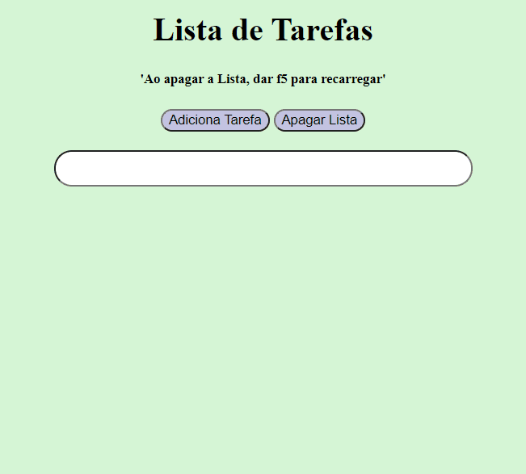

# To Do List

#### To Do List with HTML, CSS e JS.

Pequeno projeto de lista de tarefas com funções de 'SET', 'GET' e 'CLEAR'. Utilizando LocalStorage, (persistencia de dados) para setar um valor na memória e não for apagado quando o usuário atualizar o Browser. Também foi utilizado propriedades 'JSON' para converter Strings em Objeto e vise versa.

✔ 👨‍💻Tecnologias Utilizadas

- HTML
- CSS
- Javascript
